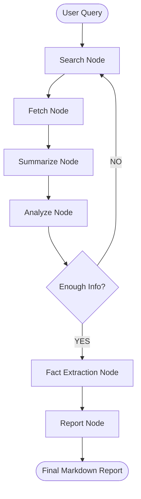

# Intelligent Research & Analysis Assistant
### *Bridging Multi-Agent Orchestration and Autonomous Synthesis*

---

## 📖 Project Overview
The **Intelligent Research Assistant** is an autonomous discovery suite designed to automate the lifecycle of technical research. Built on LangGraph, the system implements iterative reasoning loops to solve complex informational queries, autonomously evaluating data sufficiency and identifying gaps before synthesizing research-grade reports.

---

## 🛠️ System Workflow
The assistant mimics the human research process through a node-based architecture.



---

## 🚀 Technical Core

*   **Hybrid Intelligence**: Redundant search across Tavily, ArXiv, and DuckDuckGo.
*   **Tiered LLM Strategy**: Utilizes `llama-3.1-8B` for extraction and `llama-3.3-70B` for reasoning.
*   **Pre-API Optimization**: Local NLP content filtering reduces token overhead by 80%.
*   **Autonomous Iteration**: Self-correcting logic capped at 2 loops ensures research depth.

---

## 👥 Meet the Team

| Team Member | Engineering Role | Core Contribution |
| :--- | :--- | :--- |
| **Akhlesh Kumar** | **Data Architect** | Engineered the hybrid multi-source acquisition pipeline. |
| **Lakshya Agarwal** | **Workflow Strategist** | Designed the agentic logic and LangGraph orchestration. |
| **Dhruv Ramani** | **Intelligence Engineer** | Developed the tiered LLM architecture and NLP filters. |
| **Kavya Jain** | **Product Engineer** | Developed the dashboard suite and PDF distribution module. |

---

## ⚙️ Installation & Deployment

### 1. Configuration
Create a `.env` file with: `GROQ_API_KEY`, `TAVILY_API_KEY`, and `MODEL_NAME`.

### 2. Setup
```bash
pip install -r requirements.txt
python3 -m spacy download en_core_web_sm
```

### 3. Usage
**Dashboard:** `streamlit run milestone_2/app/app.py`  
**CLI:** `python3 milestone_2/main.py "Your Research Topic"`
